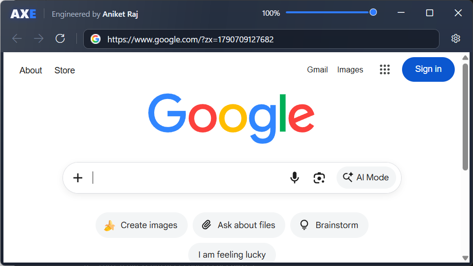
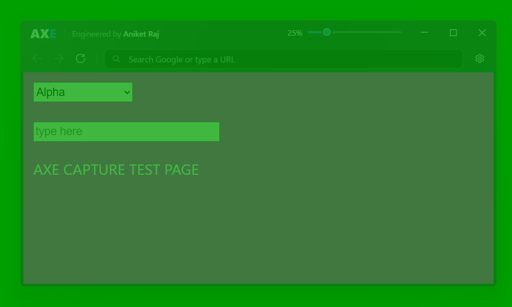

# AXE — Private Floating Browser

**Engineered by Aniket Raj**

AXE is a small, translucent Chromium browser that floats above your other windows on Windows 10/11 — and is **excluded from supported screen-capture and screen-sharing paths**. You see and use it normally on your own display; supported screenshots, recordings and screen shares show whatever is behind it instead.



<sub>Screenshot taken with capture exclusion deliberately switched off (diagnostic mode) — with protection on, a screenshot would not show AXE at all.</sub>

---

## Core feature

| On your display | In a supported screen capture |
|---|---|
|  |  |
| AXE at 25% opacity over a test backdrop *(captured with protection disabled, to show what you see)* | The same scene captured with protection on: AXE, its page, its controls and anything typed into it are absent — only the content behind AXE is captured |

AXE uses the documented Windows API `SetWindowDisplayAffinity(hwnd, WDA_EXCLUDEFROMCAPTURE)`. It is:

- **Independent of opacity** — 10 %, 25 %, 50 %, 75 % and 100 % were all verified excluded.
- **Applied to the whole window** — frame, branding, address bar, slider, web page, video, typed text, AXE's menus and dialogs, and Chromium's own dropdown popups.
- **Continuously verified** — re-applied after every window-style, state or display change and checked every 2 seconds.
- **Honest** — if Windows refuses the request, AXE shows a warning icon instead of pretending to be hidden.

> AXE is designed to exclude its window from supported Windows screen-capture mechanisms. Capture applications that intentionally bypass Windows display-affinity protections, external cameras, hardware capture devices, or privileged system inspection may still observe AXE.

AXE is a normal Windows application. It is visible in Task Manager, does not hide its process, and does not interfere with security software.

## Features

- Real Chromium browser (Microsoft Edge WebView2): HTTPS, JavaScript, cookies, local storage, video/audio, web games, downloads, copy/paste, keyboard shortcuts, right-click menus
- Address bar that accepts URLs **or** search text (Google by default; Bing, DuckDuckGo or any custom search URL)
- Opacity slider **10 % → 100 %**, starting at **25 %** (25 % visible / 75 % transparent)
- Always on top of ordinary windows
- No taskbar button; launch from Start, Search or the desktop shortcut
- Drag from the header, resize from any edge, minimize / maximize / close
- Starts at about ¼ of the screen, floating on the right
- Local-only: no account, no server, no telemetry

## Installation

1. Run **`AXE-Setup.exe`**.
2. Follow the wizard (choose the folder; optionally create a desktop shortcut).
3. Leave **Launch AXE** ticked and click **Finish**.

The installer bundles everything AXE needs (including the .NET runtime) and installs the Microsoft Edge WebView2 Runtime automatically if the PC doesn't already have it. See [docs/INSTALLATION.md](docs/INSTALLATION.md).

## Usage

| Action | How |
|---|---|
| Open a site / search | Type in the address bar and press **Enter** (`weather in Delhi` searches, `github.com` opens) |
| Force a search | Start the text with `?` |
| Focus the address bar | **Ctrl+L**, **Alt+D** or **F6** |
| Back / forward / refresh | Toolbar buttons, **Alt+←/→**, **F5** |
| Change opacity | Drag the slider, or **Ctrl+Shift+↑/↓** (±5 %) |
| Move AXE | Drag the header or the navigation bar's empty space |
| Maximize / restore | **□** button or double-click the header |
| Minimize (hide) | **─** button — AXE keeps running |
| Bring AXE back | Launch AXE again from Start/Search, or press **Ctrl+Alt+X** |
| Settings | ⚙ button (start page, search engine, starting opacity, clear browsing data) |
| Quit | **×** button — the browser session ends and the process exits |

### Transparency

The opacity slider only changes how AXE looks on **your** display. It never changes whether AXE is captured: capture exclusion is a separate window attribute, applied identically at every opacity.

## Screen-capture behaviour

Verified on Windows 11 (build 26200) with automated pixel-level tests (see [docs/TESTING.md](docs/TESTING.md)). With AXE protected, each of these captured only the content behind AXE, while unprotected controls captured AXE:

- GDI screen capture and **Windows.Graphics.Capture** (the API behind the Snipping Tool, Game Bar and modern sharing apps)
- **Win+PrintScreen**
- **DXGI Desktop Duplication** (ffmpeg `ddagrab`, the OBS display-capture path)
- **Browser screen sharing** in Chrome and Edge (`getDisplayMedia`, entire screen, as used by Google Meet and Teams on the web)

Apps that honour Windows display affinity show the content behind AXE.

Full details, including limitations: [docs/CAPTURE_EXCLUSION.md](docs/CAPTURE_EXCLUSION.md).

## Architecture

```
AXE.exe  (WPF, .NET 8, self-contained)
├── MainWindow            header, nav bar, opacity slider, WebView2 host
├── Window/
│   ├── CaptureExclusionService   SetWindowDisplayAffinity + verification
│   ├── WindowManager             layered-window opacity, maximize bounds, hotkey
│   └── WindowStateManager        minimize-to-hidden, maximize, page fullscreen
├── Browser/
│   ├── BrowserService            WebView2 lifecycle, menus, dialogs, downloads
│   └── AddressResolver           URL vs. search decision
└── Services/                     settings, logging, single instance
```

More in [docs/ARCHITECTURE.md](docs/ARCHITECTURE.md).

**Technology:** C# · .NET 8 · WPF · Microsoft Edge WebView2 (Chromium) · Win32 (user32/dwmapi) · Inno Setup 6.

## Limitations

- Capture exclusion works only against capture paths that honour Windows display affinity. It does not stop cameras, capture cards, or software that deliberately bypasses the protection.
- Requires Windows 10 version 2004 (build 19041) or later for full exclusion; on older Windows AXE falls back to showing as a black area in captures and says so.
- Exclusive-fullscreen games and some special system surfaces (Start menu, Task View, secure desktop/UAC) can appear above an always-on-top window; AXE does not try to override Windows.
- Pop-up windows open inside AXE (one view, no tabs); sites that need a separate pop-up window (some sign-in flows) navigate in place instead.
- Chromium DevTools and autofill suggestions are off by default (they open separate windows).
- x64 build (runs on Windows on ARM through emulation).

## Privacy

AXE has no server, no account and no telemetry. Browsing data (cookies, cache, site storage) stays in a local WebView2 profile under `%LOCALAPPDATA%\AXE`, and can be cleared from Settings. Diagnostic logs record technical events only — never URLs, page content or typed text. See [docs/PRIVACY.md](docs/PRIVACY.md).

## Build & packaging

Requirements: Windows 10/11, .NET 8 SDK, Inno Setup 6.

```powershell
dotnet build AXE.sln                 # build
dotnet test tests/AXE.Tests          # unit tests
powershell -ExecutionPolicy Bypass -File build\build-release.ps1   # → release\AXE-Setup.exe
```

See [docs/BUILD.md](docs/BUILD.md).

## Troubleshooting

| Problem | Fix |
|---|---|
| "WebView2 Runtime required" | Click **Get WebView2**, install it, then **Retry**. |
| AXE disappeared | It's minimized: launch AXE again from Start/Search or press **Ctrl+Alt+X**. |
| Amber ⚠ icon in the header | Windows refused capture exclusion — AXE **may be visible** in captures. Click the icon for details; check Windows is up to date. |
| AXE shows up in a particular sharing app | That app doesn't honour Windows display affinity (or uses a bypass). Share a specific window instead of the whole screen, or use a different app. |
| Ctrl+Alt+X does nothing | Another app owns that shortcut; change `ToggleHotkey` in `%LOCALAPPDATA%\AXE\settings.json`. |
| Something else | Settings → **Open log folder** and check the latest `axe-*.log`. |

## Documentation

[Architecture](docs/ARCHITECTURE.md) · [Build](docs/BUILD.md) · [Installation](docs/INSTALLATION.md) · [Privacy](docs/PRIVACY.md) · [Capture exclusion](docs/CAPTURE_EXCLUSION.md) · [Testing](docs/TESTING.md)

---

© Aniket Raj
