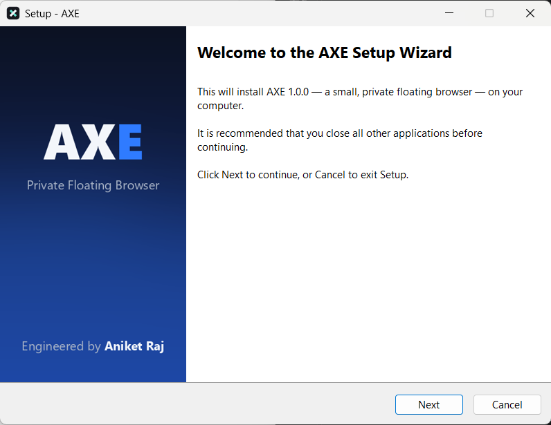

# Installing AXE

AXE ships as one file: **`AXE-Setup.exe`**. Nothing else is required: no .NET, no Visual Studio, no source code.

## Steps

1. Double-click **`AXE-Setup.exe`**.
   - Windows SmartScreen may say *"Windows protected your PC"* because the installer is not yet code-signed. Choose **More info → Run anyway** if you trust the source.
   - If asked, choose **Install for me only** (no administrator rights needed) or **Install for all users** (needs administrator rights, installs to Program Files).
2. **Welcome** → Next.
3. **Destination** — default `%LOCALAPPDATA%\Programs\AXE` for a per-user install → Next.
4. **Additional tasks** — tick *Create a desktop shortcut* if you want one → Next.
5. **Install**. If AXE is running (e.g. during an upgrade), Setup closes it first.
6. **Finish** — leave **Launch AXE** ticked to start it right away.

## What gets installed

| Item | Location |
|---|---|
| AXE program (self-contained .NET 8 app) | chosen folder (default `%LOCALAPPDATA%\Programs\AXE`) |
| Start Menu entry "AXE" (also found by Windows Search) | Start Menu → Programs |
| Desktop shortcut (optional) | Desktop |
| Uninstall entry, publisher **Aniket Raj** | Settings → Apps → Installed apps |
| Microsoft Edge WebView2 Runtime, **only if missing** | installed by Microsoft's bootstrapper |

AXE creates its own data at first run in `%LOCALAPPDATA%\AXE` (settings, logs, browser profile).

## WebView2 Runtime

AXE displays web pages with Microsoft Edge WebView2. Windows 11 and up-to-date Windows 10 already include it. If Setup doesn't find it, it runs Microsoft's WebView2 bootstrapper, which downloads and installs the runtime. **This needs an internet connection.** If it can't be installed, Setup says so, and AXE shows a **Get WebView2** button when it starts.

For fully offline machines, install Microsoft's *Evergreen Standalone Installer* for WebView2 first: https://developer.microsoft.com/microsoft-edge/webview2/

## Starting AXE

- Start menu → **AXE**, or type "AXE" in Windows Search
- Desktop shortcut (if created)
- If AXE is already running but minimized, launching it again brings the existing window back

## Uninstalling

Settings → Apps → Installed apps → **AXE** → Uninstall. Setup asks whether to also delete your AXE browsing data and settings (`%LOCALAPPDATA%\AXE`). The default is to keep them.

The WebView2 Runtime is a shared Windows component and is not removed.

## System requirements

- Windows 10 version 1809 or later (x64). **Capture exclusion requires Windows 10 version 2004 (build 19041) or later**; Windows 11 recommended.
- About 155 MB of disk space for AXE (plus the WebView2 Runtime if not present).
